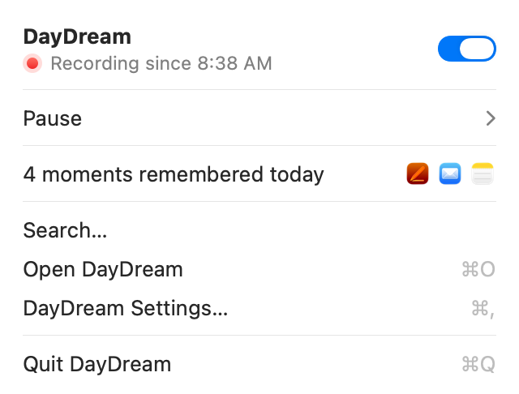

# DayDream

**Never lose your place again.**

DayDream keeps a timeline of your Mac: the apps, windows and Chrome pages you used, and what you typed. It stays on
your Mac, so you can find anything again, and AI apps you connect can check it when you ask about your own work.

> [!IMPORTANT]
> DayDream is beta software. Expect bugs. Your history isn't encrypted yet (only what you type is), so turn on FileVault.

## Install

You need an Apple silicon Mac with macOS 15 or later.

1. Download DayDream from [getdaydream.app](https://getdaydream.app) or the [Releases page](https://github.com/getnorthlight/daydream/releases/latest).
2. Drag it to Applications and open it. Setup asks for two permissions and what to remember.
3. Press **Start Recording**.

Updates download quietly and install the next time DayDream quits. Step-by-step: [install guide](docs/install.md).

## What it records

- **Recorded:** which app and window you're in, and when; page titles and sites in Google Chrome; what you type in
  the apps and sites you allow. Typing and Chrome pages start on in setup, and one click turns either off.
- **Never recorded:** screenshots, the screen, audio, password fields, the contents of your files,
  Safari and other browsers DayDream knows, Incognito windows,
  common password managers, and apps and sites you exclude.

Your history stays on your Mac. It leaves only if you connect an AI app, turn on cloud summaries, or back up to a
synced folder. DayDream sends anonymous usage counts, never your history; turn them off in Settings › Advanced.
Details: [privacy policy](PRIVACY.md).

## Connect an AI app

In **Settings › Connections**, one click connects ChatGPT, Claude Desktop, Claude Code, Cursor or Windsurf. Then ask
things like "where did I leave off yesterday?" or "write my standup".

The AI app gets four read-only tools:

- **timeline:** what you did in a period, like today or this week.
- **search:** find one thing: a doc, site, person or project.
- **details:** one item in full, with the words you typed if you allow it.
- **status:** whether DayDream is set up and recording.

They can't change, delete or send anything. What an AI app reads goes to its AI provider as part of that chat.

In [Lost Thread](https://github.com/getnorthlight/lost-thread), an open benchmark, Claude's helpful answers about
people's own weeks went from 3.7% to 66.7% with DayDream.

## More

- **Everything in detail:** what's recorded, permissions, summaries, network use and known limits: [docs/README-details.md](docs/README-details.md).
- **Report a problem:** choose **Report a Problem…** in DayDream's menu. Never paste your history into a public issue.
- **Build from source:** `scripts/bootstrap.sh && swift build`. See [Build from source](docs/README-details.md#build-from-source) and [CONTRIBUTING.md](CONTRIBUTING.md).
- **Security:** [SECURITY.md](SECURITY.md). Questions: [FAQ](docs/faq.md).

## License

[MIT](LICENSE). The DayDream name and icon aren't covered; see [TRADEMARKS.md](TRADEMARKS.md). DayDream builds on
[open-codex-computer-history](https://github.com/hqhq1025/open-codex-computer-history), Sparkle, llama.cpp, Qwen and
Typesense; see [credits](docs/README-details.md#license-trademarks-and-credits).
