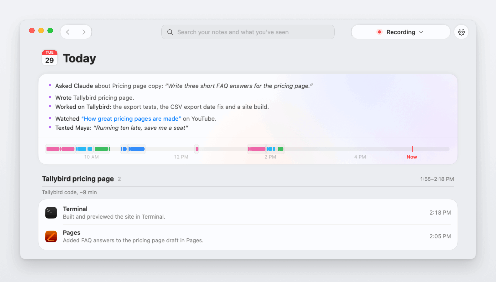
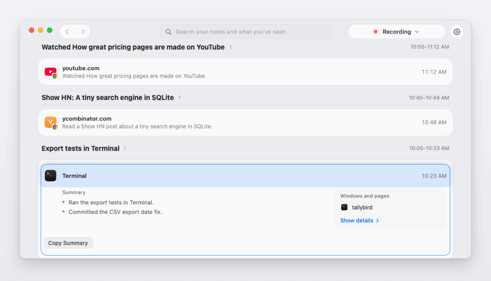
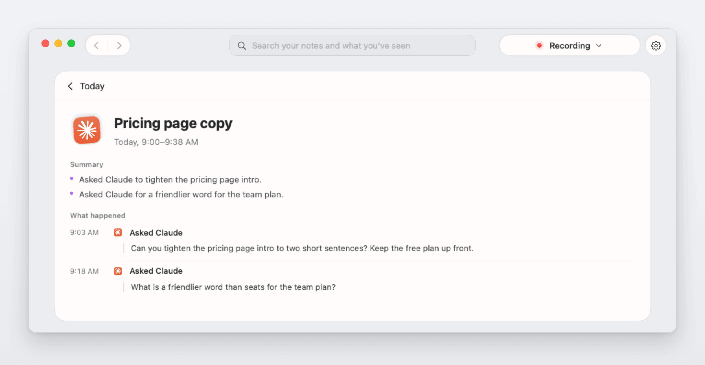
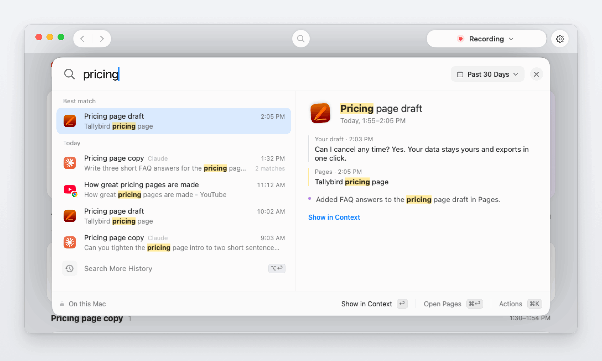
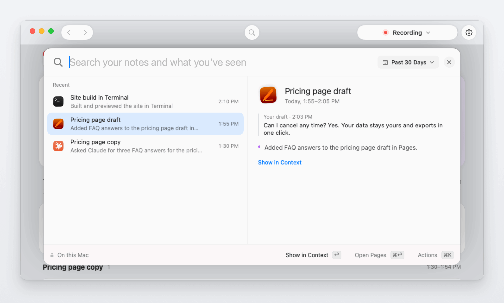
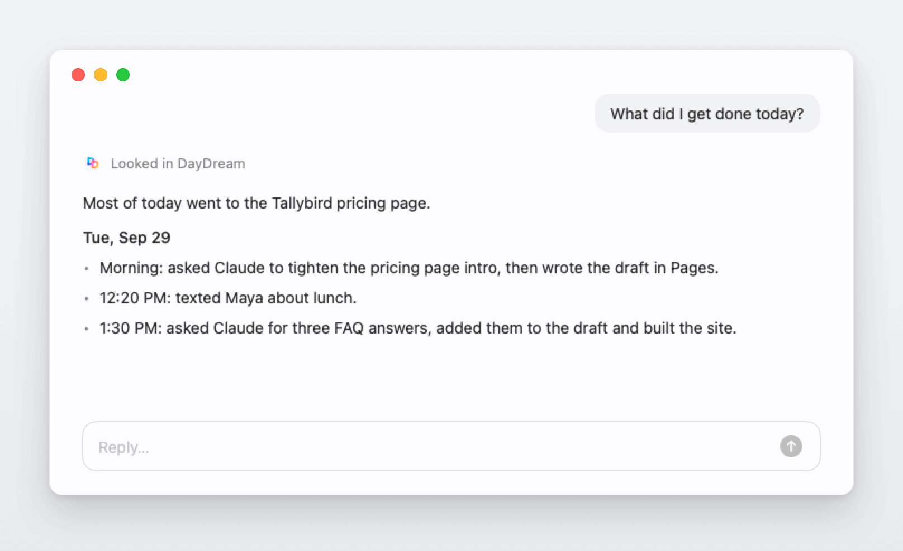
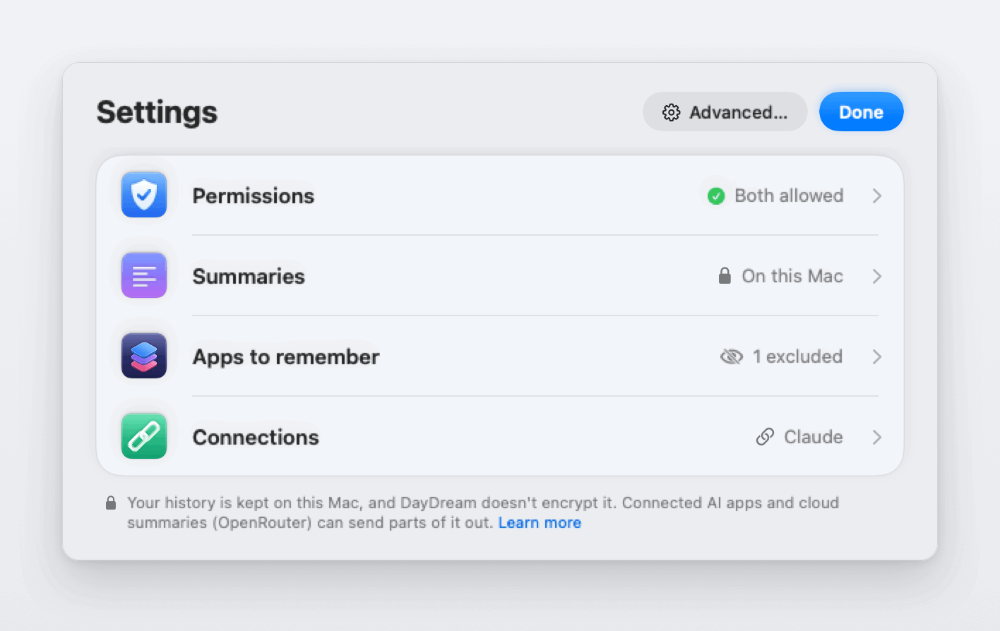
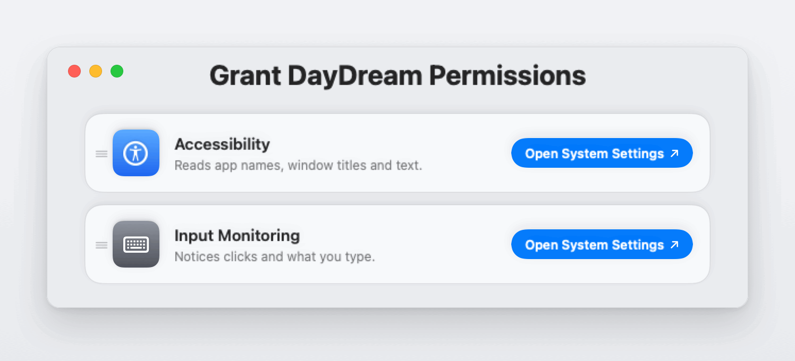
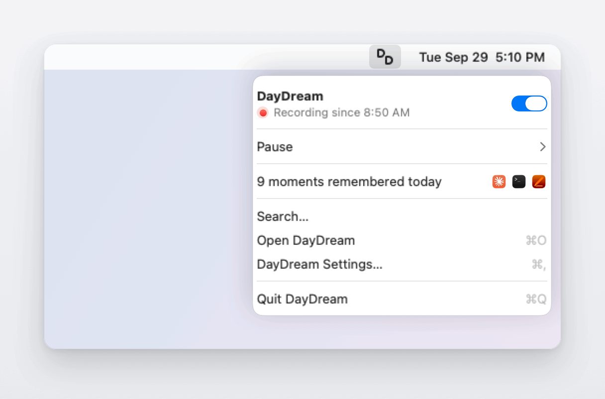

# DayDream

<p align="center">
  <picture>
    <source media="(prefers-color-scheme: dark)" srcset="docs/images/readme/today-dark.png">
    
  </picture>
</p>

<h3 align="center">Never lose your place again.</h3>

<p align="center">DayDream remembers what you did on your Mac.<br>Ask it, or an AI app you connect, "where was I?"</p>

<p align="center"><a href="#download">Download</a> · <a href="#build-from-source">Build from source</a> · <a href="docs/guide.md">Guide</a> · <a href="PRIVACY.md">Privacy</a></p>

> [!IMPORTANT]
> **DayDream is beta software (version 0.1).** Expect bugs. Your history is **not encrypted** yet, so turn on FileVault. Please read [what DayDream records](docs/guide.md#what-daydream-records) and its [known limits](docs/guide.md#known-limits) before you install it.

## What it does

### Your day, in a few lines

Today puts your work first: the chats, documents and code you spent time on, then what you read and watched, then one line for the people you talked to. Every moment is on the timeline below it.

<p align="center">
  <picture>
    <source media="(prefers-color-scheme: dark)" srcset="docs/images/readme/day-dark.png">
    
  </picture>
</p>

### Every moment, with what happened

Open a moment to see its summary and what happened in it, in the words you typed: what you asked Claude, what you wrote, what you ran.

<p align="center">
  <picture>
    <source media="(prefers-color-scheme: dark)" srcset="docs/images/readme/moment-dark.png">
    
  </picture>
</p>

### Search finds your own words

Search looks through window titles, pages, notes and what you typed. Each result shows the line that matched, and the right side shows where it came from.

<p align="center">
  <picture>
    <source media="(prefers-color-scheme: dark)" srcset="docs/images/readme/search-dark.png">
    
  </picture>
</p>

### Pick up where you left off

Open search with nothing typed and your last moments are there. The draft you were in is one press away.

<p align="center">
  <picture>
    <source media="(prefers-color-scheme: dark)" srcset="docs/images/readme/recent-dark.png">
    
  </picture>
</p>

### Your AI apps know your context

Connect Claude, ChatGPT, Cursor or Windsurf with one click. Then ask "what did I get done today?" and the answer comes from your own history.

<p align="center">
  <picture>
    <source media="(prefers-color-scheme: dark)" srcset="docs/images/readme/ai-dark.png">
    
  </picture>
</p>

### Kept on your Mac

Your history is kept on this Mac. Summaries can be written on this Mac too. DayDream has no account and no analytics, and you choose what an AI app or cloud summaries may read.

<p align="center">
  <picture>
    <source media="(prefers-color-scheme: dark)" srcset="docs/images/readme/settings-dark.png">
    
  </picture>
</p>

### Set up in minutes

Setup asks for two macOS permissions, one button each. After that DayDream lives in your menu bar, with one switch to pause or stop.

<table>
  <tr>
    <td width="50%"><picture><source media="(prefers-color-scheme: dark)" srcset="docs/images/readme/setup-dark.png"></picture></td>
    <td width="50%"><picture><source media="(prefers-color-scheme: dark)" srcset="docs/images/readme/menu-dark.png"></picture></td>
  </tr>
</table>

Every picture here shows the app's own screens, drawn with sample data for a made-up person. The chat window above is a stand-in for an AI app. [scripts/readme-pictures](scripts/readme-pictures/render.sh) draws them again.

## Privacy

- **Kept on this Mac.** Your history is in one folder in your user account. It isn't encrypted, only what you type is, so turn on FileVault.
- **You choose what's recorded.** Typed text and Web pages in Chrome start on in setup, and one click turns either off. [Typed text](docs/guide.md#typed-text) lists every app and website it covers.
- **What you type** is encrypted on this Mac. DayDream deletes the exact words after 7 days unless you choose another time.
- **Never saved:** screenshots, audio, password fields, anything in Chrome while an Incognito or Guest window is open, blocked sites (banking, passwords, sign-in, payment, health and government), and apps you exclude.
- **Summaries on this Mac** send nothing to write your notes. **Cloud summaries** are optional, use your own OpenRouter key and ask for hosts that don't keep your data (zero data retention). If you choose them, they get the words you type.
- **AI apps you connect** can read your history, and what they read goes to their AI provider.
- **No account, analytics or telemetry.** [Network connections](docs/guide.md#network-connections) lists every time DayDream goes online.
- **Your own Mac only.** Use DayDream only to record yourself, on your own Mac user account.

The [guide](docs/guide.md) has every detail, and [PRIVACY.md](PRIVACY.md) is the privacy policy.

## Works with your AI apps

DayDream includes a read-only [Model Context Protocol](https://modelcontextprotocol.io) (MCP) server. Settings › Connections connects ChatGPT, Claude Desktop, Claude Code, Cursor or Windsurf with one button, or use Terminal:

```sh
mac-mem connect claude-desktop
mac-mem disconnect claude-desktop
```

The AI app starts `mac-mem mcp` itself and talks to it over standard input and output. It opens no network port. The tools are `status`, `context`, `current-context`, `search`, `read`, `open`, `recall`, `recap` and `moment_details`. They can't start or stop recording, change settings or delete anything. Other MCP apps: see [Connect an AI app by hand](docs/install.md#connect-an-ai-app-by-hand). More in the guide's [Connect an AI app](docs/guide.md#connect-an-ai-app).

## Requirements

- A Mac with Apple silicon and macOS 15 or later. DayDream is tested on macOS 26.
- Summaries on this Mac need 8 GB of memory and a one-time 2.74 GB model download.
- Web pages and typing on websites are recorded in Google Chrome only.

## Download

The first download is coming soon at [getdaydream.app](https://getdaydream.app) and on the Releases page. Until then you can [build it from source](#build-from-source).

Releases are signed with DayDream's Apple Developer ID and notarized by Apple. DayDream then updates itself from GitHub Releases. The [install guide](docs/install.md) has every step, with pictures.

## Build from source

You need an Apple silicon Mac with Xcode or the Xcode Command Line Tools (`xcode-select --install`).

```sh
git clone https://github.com/getnorthlight/daydream.git
cd daydream
scripts/bootstrap.sh
swift build
```

`scripts/bootstrap.sh` downloads the Sparkle 2.9.6 framework (the updater) from its official GitHub release into `Vendor/`, and checks it against a pinned SHA-256 before unpacking it. It's safe to run again, and `--offline` keeps it off the network. `swift build` then builds:

- `MacMem`: the app itself;
- `mac-mem`: the command-line tool and MCP server;
- `mac-mem-backup`: the backup helper.

A plain `swift build` leaves out the release's typing flags, so typed text works only in Notes and TextEdit and typing on websites is compiled out. Release builds define both (`swift build -Xswiftc -DDAYDREAM_OWNER_TYPING -Xswiftc -DDAYDREAM_CHROME_TYPING`).

`swift build` plus the checks is the supported development loop. There's no public recipe for a runnable `.app` yet: `scripts/package.sh` needs inputs that aren't in this repository, and release builds are signed with DayDream's Developer ID ([RELEASE.md](RELEASE.md)).

Builds you make yourself aren't signed with DayDream's Developer ID. macOS treats each one as a new app, so you may need to turn the permissions on again after each rebuild. They don't check for updates: only release builds carry the update feed and DayDream's public update key. How the signed download is made is in [RELEASE.md](RELEASE.md).

You can try the command-line tool on made-up data without touching your real history:

```sh
demo="$(mktemp -d)/daydream-demo"
.build/debug/mac-mem --home "$demo" demo
.build/debug/mac-mem --home "$demo" --local search SQLite
```

Never point `demo` or other test commands at your real history folder. To run the checks, see [CONTRIBUTING.md](CONTRIBUTING.md).

## Tools

- **`mac-mem`**: the command-line tool and MCP server, inside the app at `DayDream.app/Contents/MacOS/mac-mem`. `status`, `search`, `day`, `read`, `connect`, `disconnect` and `connections` work on your history; `demo` fills a test folder with made-up data. Pass `--home <folder>` to point it at a test folder.
- **`mac-mem-backup`**: the backup helper behind Settings › Advanced › Backup and restore. See [docs/backup-restore.md](docs/backup-restore.md).
- **The checks**: `bash runner-1001/run-headless.sh` builds the package and runs every headless check with made-up data. [CONTRIBUTING.md](CONTRIBUTING.md) lists the quick ones, like `python3 scripts/docs-claims-checks.py`.
- **Pictures**: `scripts/readme-pictures/render.sh` draws the pictures on this page, and `scripts/docs-install-render.swift` the ones in the install guide, from the app's own views and sample data.

## Project layout

| Path | What's there |
| --- | --- |
| `Sources/MacMemApp` | The app: menu bar, windows, and the recorder |
| `Sources/MemoryUI` | SwiftUI views |
| `Sources/MemoryCore` | Storage (SQLite), privacy rules, search, deletion and backup support |
| `Sources/HistoryCore` | Event model and observation rules, derived from open-codex-computer-history (see [credits](#license-trademarks-and-credits)) |
| `Sources/MacMemCLI` | The `mac-mem` command-line tool and MCP server |
| `PrivacyPolicy/` | The rules that decide whether typed text may be recorded |
| `WriterBackend/` | Summaries |
| `BackupRestore/` | The `mac-mem-backup` helper |
| `BrowserBridge/` | Browser code that isn't used by the app in this version |
| `adapters/` | Glue between the app and the packages above |
| `Checks/`, `Tests/`, `scripts/*-checks.*` | Checks and tests |
| `packaging/` | `Info.plist`, icons and dependency pins |
| `docs/` | [How DayDream works](docs/README.md) |

## Learn more

- [Guide](docs/guide.md): what DayDream records and sends, permissions, summaries, updates and known limits.
- [Install guide](docs/install.md), [Uninstall](docs/uninstall.md) and [From Mac Mem to DayDream](docs/rename.md).
- [Privacy and security FAQ](docs/faq.md), [PRIVACY.md](PRIVACY.md) and [SECURITY.md](SECURITY.md).
- [All docs](docs/README.md).

## Contributing and security

- Bug reports and ideas are welcome in [Issues](https://github.com/getnorthlight/daydream/issues). Reproduce problems with demo data, never your own history.
- Found a security problem? Please report it privately; see [SECURITY.md](SECURITY.md).
- Questions about privacy? See the [privacy and security FAQ](docs/faq.md) and the [privacy policy](PRIVACY.md).
- Want to contribute code? See [CONTRIBUTING.md](CONTRIBUTING.md).

## License, trademarks and credits

DayDream's source code is licensed under the [MIT License](LICENSE). Copyright (c) 2026 The DayDream Authors.

The DayDream name and icon are **not** covered by that license; see [TRADEMARKS.md](TRADEMARKS.md). Third-party code and its licenses are listed in [THIRD-PARTY-NOTICES.md](THIRD-PARTY-NOTICES.md), and the app carries the same files.

DayDream builds on:

- **[open-codex-computer-history](https://github.com/hqhq1025/open-codex-computer-history)** (MIT, Copyright (c) 2026 Open Codex Computer History contributors). DayDream's event model and observation rules (`Sources/HistoryCore`) and parts of its recorder are derived from this project. Thank you.
- **[Sparkle](https://sparkle-project.org)** (MIT) for app updates.
- **[llama.cpp](https://github.com/ggml-org/llama.cpp)** (MIT), whose libraries are inside the app, and the **Qwen** model (Apache 2.0), downloaded when you choose it, for summaries on this Mac.
- **[Typesense](https://github.com/typesense/typesense)** (GPL-3.0), the unmodified official build inside the app, for search on this Mac. Its source is attached to every release.

DayDream is an independent project. It isn't affiliated with or endorsed by Apple, Google, OpenRouter or the authors of the projects above.
