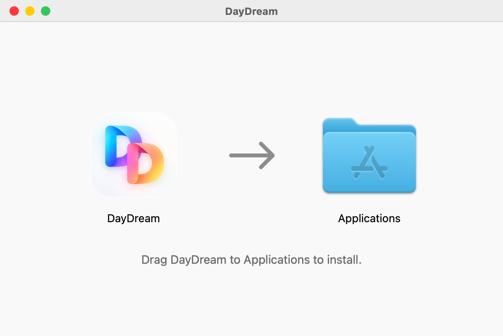
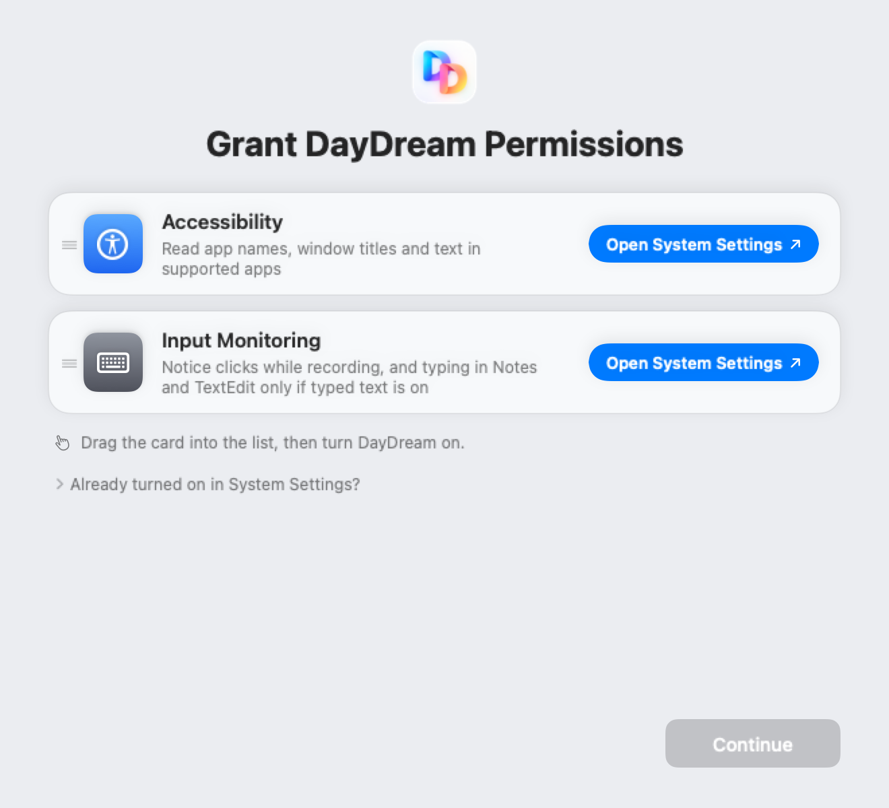
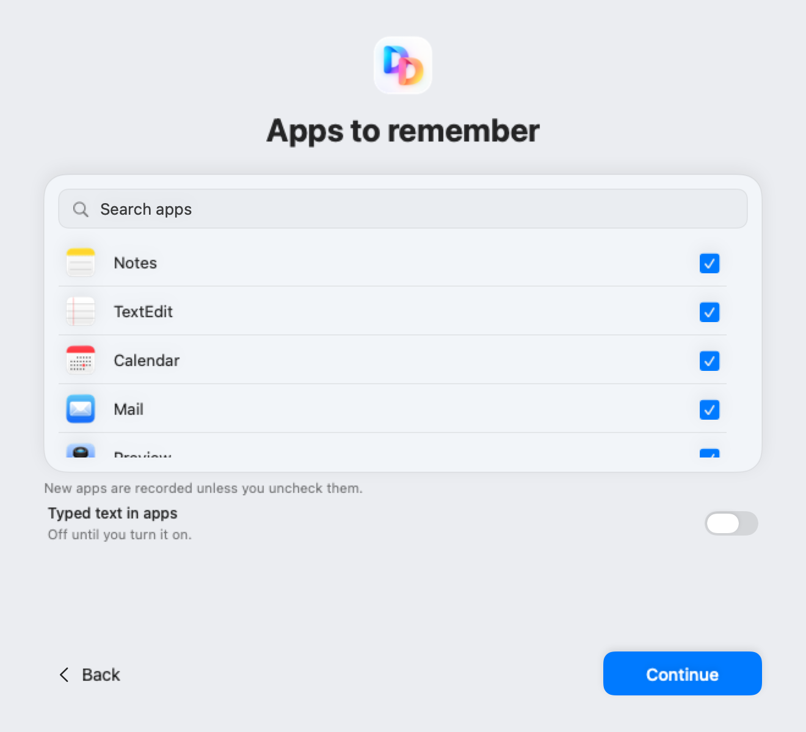
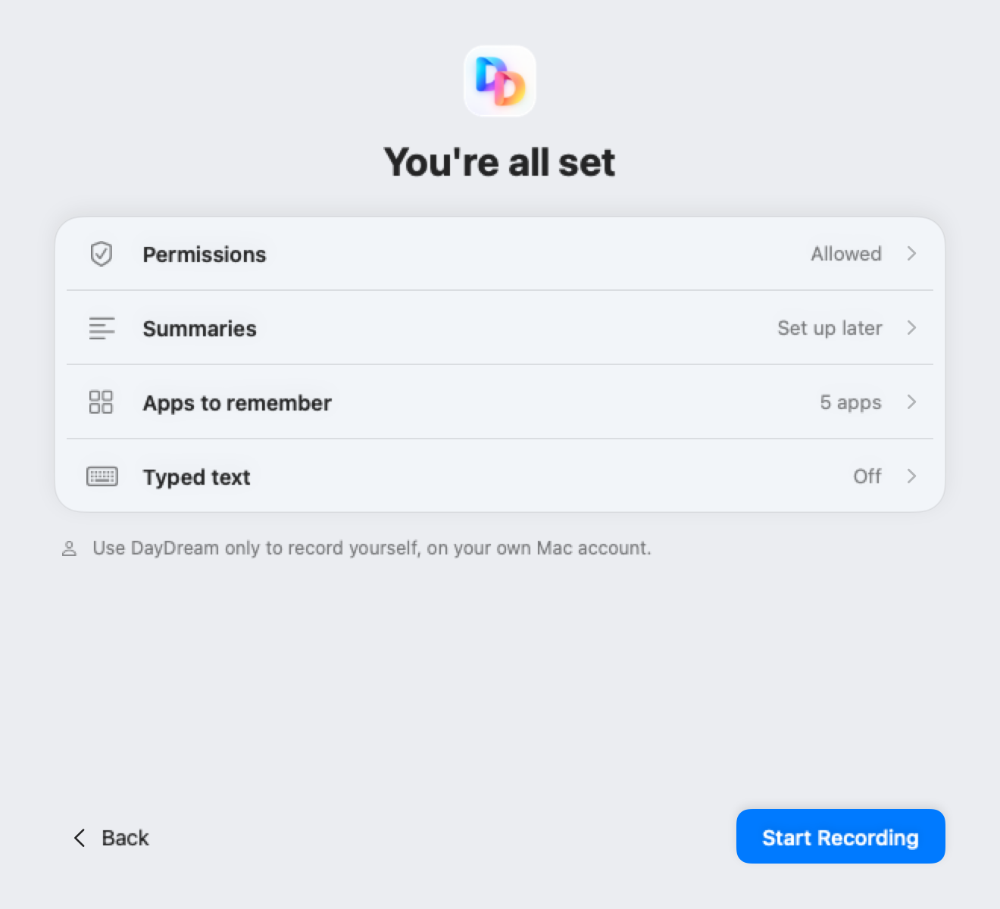
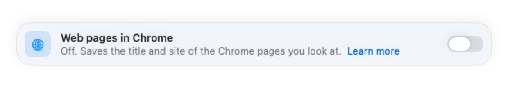

# Install DayDream

This guide takes about ten minutes. You don't need to use Terminal.

**Before you start**

- You need a Mac with Apple silicon (M1 or later) and macOS 15 or later. Intel Macs aren't supported.
- DayDream is tested on macOS 26.
- DayDream is beta software. Your history is kept on your Mac and isn't encrypted yet, so turn on FileVault first: System Settings › Privacy & Security › FileVault.

The pictures below are drawn from DayDream's own screens with sample data.

## 1. Download

Go to the [latest release](https://github.com/getnorthlight/daydream/releases/latest) and download `DayDream-<version>.dmg` (for example `DayDream-0.1.0.dmg`).

### Check the download (optional)

Each release lists the download's SHA-256 fingerprint. To compare it, open Terminal and run this, with your file's name:

```sh
shasum -a 256 ~/Downloads/DayDream-0.1.0.dmg
```

The long code it prints must match the one in the release notes exactly. If it doesn't, don't open the file. Delete it and download it again.

## 2. Drag DayDream to Applications

Open the file you downloaded. A window like this appears. Drag DayDream onto Applications.



Then close the window and eject DayDream in the Finder sidebar.

Always open DayDream from Applications, not from the install window. If you open it from the install window, DayDream asks you to move it to Applications first, and won't record until you do. Press **Quit DayDream** in that message, drag DayDream to Applications, then open it from there.

## 3. Open DayDream

Open DayDream from your Applications folder. macOS says it was downloaded from the internet and asks if you're sure. Choose **Open**. macOS has already checked the app with Apple.

DayDream puts an icon in the menu bar at the top of your screen. The first time it opens, setup starts. Until you finish setup, it opens again each time you open DayDream, and **Start Recording** takes you back to it.

## 4. Turn on the two permissions



DayDream needs **Accessibility** and **Input Monitoring** to record. It never shows a macOS prompt for them: you turn them on in System Settings.

1. On the Accessibility card, press **Open System Settings**. System Settings opens at Privacy & Security › Accessibility.
2. Turn on **DayDream** in the list. macOS asks for your password or Touch ID. If DayDream isn't in the list, drag its card from the setup window into the list, then turn it on.
3. Do the same for Input Monitoring.
4. Come back to DayDream. Each card shows **Allowed** as soon as its permission is on. **Continue** turns blue when both are.

macOS applies Input Monitoring only after DayDream reopens. When that's needed, or when a permission still shows as off after you turned it on, the page shows **Quit & Reopen**: press it and DayDream opens again by itself.

Why these two? Accessibility lets DayDream read which app is in front and the window title. Input Monitoring lets it notice clicks, and what you type in the apps and websites typing covers, while typed text is on. It only listens. It can't change or block anything.

## 5. Summaries: set up later

The next page asks about summaries, short notes about your moments and days. You can skip this: **Summaries on this Mac** starts on (on a Mac that can run it); to skip summaries, turn it off and press **Continue**. Your history is complete without them.

If you want them now, turn one on:

- **Cloud summaries.** Paste your own [OpenRouter](https://openrouter.ai) API key. The line under the switch says what is sent: your activity, including words you type and Chrome page titles and sites (never full web addresses). OpenRouter bills your account.
- **Summaries on this Mac.** Notes are written on your Mac. **Continue** downloads the model (2.74 GB) if it isn't on your Mac yet. It needs 8 GB of memory.

The [README](../README.md#summaries) explains what each one sends.

## 6. Choose the apps to remember



Every app is remembered unless you uncheck it. Uncheck any app you never want recorded, such as a banking or health app. Common password managers are always skipped.

**Typed text** and **Web pages in Chrome** start on; each switch has one line that says what it saves. Turn either off with one click, then or any time in Settings. Nothing is recorded before you press Start Recording. Typed text saves what you type in apps on a fixed list, such as Notes, Spotlight and Terminal, and on websites in Google Chrome while **Web pages in Chrome** is on too. Messages and email are on too; turn them off in Settings › Apps to remember. The README's [Typed text](../README.md#typed-text) section lists every app and what is always skipped.

What you type is encrypted on your Mac, and DayDream deletes the exact words after 7 days unless you choose another time. AI apps you connect can read the words you typed and sent while **Let AI apps read what you typed** is on (on by default; Settings › Connections). With it off, they see only where and about how much you typed, and your summaries. Cloud summaries, if you choose them, get the words to write your notes. Window titles can include words you typed, like an email subject or a shell command. Those are saved, read by AI apps and sent to cloud summaries like any other window title. Anyone typing on this Mac account while it's on is recorded as you. Leave it off if you type passwords or other secrets into normal text boxes.

## 7. Review and start



Check your choices. To change one, click it. When you're ready, press **Start Recording**. If something still needs doing, such as a permission, the button says so (for example **Allow Permissions**) and takes you to that page.

The first time you start recording, macOS asks whether DayDream may show notifications. DayDream uses them only to tell you when recording stopped, or didn't start again, without you asking. You can say no; the menu bar panel says why too.

## 8. Use it from the menu bar


Click the DayDream icon in the menu bar to:

- turn recording on or off with the switch;
- pause for 5, 15 or 30 minutes or 2 hours (Pause ›);
- see how many moments were remembered today, and open DayDream to look back or search;
- open Settings.

If your Mac sleeps or locks while recording, DayDream starts recording again when you come back. If it can't, it shows a notice that says why and how to start again. If recording was on when you quit DayDream or restarted your Mac, it starts again when DayDream opens. DayDream opens at login; you can turn that off in Settings › Advanced.

## Optional: remember Chrome pages



Setup shows **Web pages in Chrome** switched on. Nothing is saved from Chrome until macOS lets DayDream control it. With the switch on, macOS asks right after setup starts recording (or the next time Google Chrome comes to the front, if it isn't open then). Say OK. If you said no, or turned the switch off in setup:

1. Open DayDream Settings › Apps to remember.
2. If you turned **Web pages in Chrome** off, turn it on. DayDream shows what it saves and never saves. Press **Turn On**.
3. Press **Allow…** and let macOS give DayDream access to Google Chrome.

DayDream then saves the title and site of the Chrome page in front, and when. If typed text is on too, it also saves what you type on websites, with the site. It saves nothing while any Incognito or Guest window is open, and it skips common banking, password, health and government sites. Other browsers DayDream knows, like Safari, aren't recorded. [PRIVACY.md](../PRIVACY.md#browser-history-google-chrome) has the details.

## Optional: connect an AI app

In DayDream Settings › Connections, press **Connect** next to an AI app. DayDream adds one `daydream` entry to that app's settings file and restarts the app if it's open. Claude Desktop then opens on a new chat with a first question typed in, for you to send; for other apps DayDream copies the question instead. The question asks the AI app to explain DayDream, check that it's connected and ready (through DayDream's `status` tool), and suggest three questions to ask. **Disconnect** undoes it. For Claude Code, start a new session to use DayDream.

Whatever the AI app reads from DayDream can go to its AI provider. Read [what AI apps can see](faq.md#what-can-an-ai-app-i-connect-see-and-do) first.

### Connect an AI app by hand

For an MCP app that isn't in the Connections list. The commands below use `/Applications/DayDream.app`; if you installed DayDream in `~/Applications`, use `$HOME/Applications/DayDream.app` instead (and the full path, starting with `/Users/`, in the JSON).

1. In Terminal, create a connection. This prints a secret token. Treat it like a password.

   ```sh
   DD="/Applications/DayDream.app/Contents/MacOS/mac-mem"
   "$DD" --home "$HOME/Library/Application Support/DayDream" \
     --client my-ai-app --recipient me grant
   ```

   `--client` and `--recipient` are labels you choose. The command prints `{"capability":"<token>"}`.

2. Add DayDream to the AI app's MCP settings. Many apps use an `mcpServers` block like this one:

   ```json
   {
     "mcpServers": {
       "daydream": {
         "command": "/Applications/DayDream.app/Contents/MacOS/mac-mem",
         "args": ["--client", "my-ai-app", "--recipient", "me", "mcp"],
         "env": { "MAC_MEM_CAPABILITY": "<token>" }
       }
     }
   }
   ```

3. Restart the AI app. Restart it again after each DayDream update.

To disconnect it, remove the entry from the AI app's settings and run the same command with `revoke` in place of `grant`.

## If something goes wrong

- **A permission won't stick.** Open System Settings › Privacy & Security, remove DayDream from Accessibility and Input Monitoring with the minus button, then drag its card from setup back into each list and turn it on. Press **Quit & Reopen** if DayDream shows it.
- **Recording stopped.** The menu bar panel says why. Choose **Resume Now** if it's paused, or turn the switch on if it's off. If something must be fixed first, one button in the switch's place (for example **Allow…**) opens that step.
- **"Move to Applications first."** You opened it from the install window. Quit DayDream, drag it to Applications and open it from there.
- **"DayDream is already open."** Another copy of DayDream is using your history, for example one still open from the install window. This copy opens your history by itself as soon as the other one closes.
- **Anything else.** Choose Help › Report a Problem, and see [Report a problem](../README.md#report-a-problem).

To remove DayDream, see [docs/uninstall.md](uninstall.md).

## Updating the pictures

The pictures in this guide come from `scripts/docs-install-render.swift`, which draws DayDream's own setup, menu bar and Settings views with sample data. It never runs the app or takes a screenshot. The check suite renders them on every run; copy the new files into `docs/images/` when a screen changes. Every release is built with the two typing defines that `stage` passes (`OWNER_SWIFT_FLAGS` in `scripts/developer-id-release.py`), so render the pictures with them too, against a build made with them; otherwise the typing and Chrome screens show text a release doesn't.
